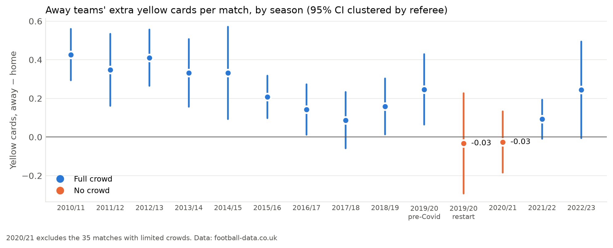
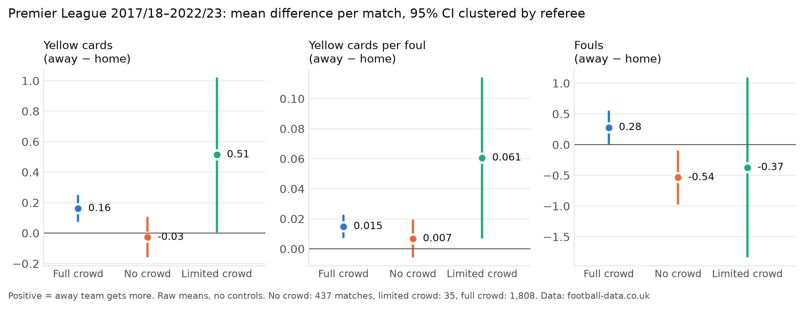
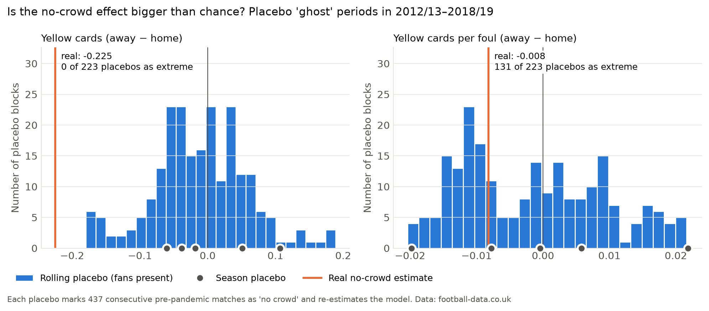

# Do crowds bias referees? Evidence from Premier League matches without fans

When COVID-19 emptied stadiums, football ran an experiment nobody could have planned: the same referees, the same teams, the same rules — but no crowd.
This project uses 2,280 Premier League matches (2017/18–2022/23), including 437 played behind closed doors, to ask whether the crowd makes referees treat away teams more harshly.

## Short answer

**Yes, for yellow cards.** With fans, away teams receive about 0.16 more yellow cards per match than home teams. Without fans, that gap disappears.
After controlling for team strength, the long-run trend and each referee's personal style, playing without a crowd reduces the away team's card disadvantage by **0.23 yellow cards per match** (95% CI 0.08 to 0.37; wild cluster bootstrap p = 0.009).

**The change runs mostly through fouls, not through the card decision itself** (exploratory result, see below). Without a crowd, home teams are called for about one more foul per match (+10%). For a given foul, the probability of a card barely changes.



*The away-team card gap had been shrinking since 2010/11, but both no-crowd periods are the lowest points in the series.*

---

## Why this is a natural experiment

Normally, crowd effects are hard to measure: big crowds come with big clubs, important matches and strong home teams.
The pandemic removed the crowd for reasons unrelated to football, which gives an unusually clean comparison:

- **No crowd (437 matches):** the June–July 2020 restart and almost all of 2020/21.
- **Limited crowd (35 matches):** 2,000 fans in some December 2020 matches, and up to 10,000 in the last two rounds of 2020/21.
- **Full crowd (1,808 matches):** everything else in 2017/18–2022/23.

The classification was checked match by match against official Premier League attendance figures and Wikipedia: [data/ghost_matches_sources.md](data/ghost_matches_sources.md).

## Data

- **Source:** [football-data.co.uk](https://www.football-data.co.uk), Premier League, 2010/11–2022/23 (4,940 matches). Earlier seasons are used to warm up team ratings and for placebo tests.
- **Variables per match:** referee, result, fouls, and yellow and red cards for each team.
- **Cleaning:**
  - Three referee names were corrected after checking match reports.
  - 28 matches with implausibly low foul counts (≤ 2 for a team) are excluded from cards-per-foul measures only.
  - Details: [notebooks/01_data.ipynb](notebooks/01_data.ipynb).
- **Note on yellow cards:** in this English data, the first yellow is not counted when a second yellow becomes a red card.

## Method in plain language

| Choice | What it means | Why |
|---|---|---|
| **Outcome: away − home** | Yellow cards, yellow cards per foul and fouls, each as "away team minus home team" | Anything that affects both teams equally cancels out |
| **Referee fixed effects** | Each referee is compared only with themselves | The result cannot come from different, more lenient referees working during the pandemic |
| **Team strength (ELO)** | A rating built from past results | Weaker teams defend more and collect more cards. ELO is used instead of betting odds, because odds from the no-fans period already price in the missing home advantage |
| **VAR and trend** | VAR was introduced in 2019/20, and the card gap was shrinking anyway | Keeps these from being mistaken for the crowd effect |
| **Wild cluster bootstrap** | p-values that account for having only 33 referees | Standard clustered p-values can be too optimistic with few clusters |
| **Placebo tests** | Pretend 437 pre-pandemic matches had no fans, 223 times | Shows how large an "effect" pure chance produces |
| **Power (MDE)** | The smallest effect this design could reliably detect | Separates "no effect" from "too little data to tell" |

The specification was written down and committed **before** any comparison of crowd and no-crowd matches: [PREREGISTRATION.md](PREREGISTRATION.md).

## Results

### Main model (pre-registered)

| Outcome (away − home) | Effect of no crowd | 95% CI | p (bootstrap) | p (Holm) | Smallest detectable effect |
|---|---|---|---|---|---|
| **H1:** yellow cards | **−0.225** | −0.371 to −0.079 | **0.009** | **0.018** | 0.209 |
| **H1b:** yellow cards per foul | −0.008 | −0.025 to 0.008 | 0.378 | 0.378 | 0.024 |

- **H1 is supported.** Without fans, away teams lose their card disadvantage.
- **H1b is not supported, but that is not proof of no effect.** With fans, the away team's cards-per-foul excess is only 0.015, smaller than the smallest effect this design can detect (0.024). The confidence interval does rule out effects as large as those found in Italian and French closed-door matches (Reade et al., 2022: 0.035–0.044).



### Robustness checks (pre-registered)

| Check | Yellow cards | p (bootstrap) | Cards per foul | p (bootstrap) |
|---|---|---|---|---|
| Main model | −0.225 | 0.009 | −0.008 | 0.378 |
| Limited-crowd matches dropped | −0.225 | 0.009 | −0.008 | 0.382 |
| VAR seasons only (2019/20+) | −0.237 | 0.009 | −0.010 | 0.290 |
| 2020/21 only (2020 restart dropped) | −0.226 | 0.009 | −0.005 | 0.576 |
| Season fixed effects | −0.271 | 0.189 | −0.025 | 0.179 |

- **The yellow-card effect is stable across checks.**
- **With season fixed effects** the estimate is slightly larger but no longer significant. This was expected: 2020/21 is almost entirely behind closed doors, so a season dummy absorbs it and only the 92 restart matches remain to identify the effect. The smallest detectable effect rises from 0.21 to 0.53.
- **A Poisson model of cards per foul** (yellows with log(fouls) as an offset) gives the same picture as the ratio: away teams' cards-per-foul rate changes by −4.0% relative to home teams (95% CI −10.0% to +2.4%, p = 0.22).

### Placebo tests (pre-registered)



- **Yellow cards:** none of the 223 placebo periods produces an effect as large as the real one, and none of the 5 placebo seasons does either.
- **Cards per foul:** the real estimate sits in the middle of the placebo distribution (131 of 223 placebo periods are as extreme).
- **Caveat:** placebo blocks overlap, so "0 of 223" is a benchmark, not an exact p-value.
- **Consistency check:** the spread of the placebo estimates (SD 0.070) is close to the model's clustered standard error (0.075), so the main uncertainty estimate looks right.

### Mechanism: fouls or cards? (exploratory, not pre-registered)

Added after seeing the results ([notebooks/06_exploratory_mechanism.ipynb](notebooks/06_exploratory_mechanism.ipynb)). Same model as above.

| Without a crowd | Change per match | p (bootstrap) |
|---|---|---|
| Fouls called against the **home** team | **+1.07** (from about 10.3) | < 0.001 |
| Fouls called against the away team | +0.05 | 0.83 |
| Home yellow cards | −0.20 | 0.02 |
| Away yellow cards | −0.42 | < 0.001 |

- **Fouls:** without fans, referees call about 10% more fouls against the home team. Away fouls do not change.
  - This echoes a classic experiment: referees watching video with crowd noise called 15.5% fewer fouls against the home team (Nevill et al., 2002).
- **Cards:** both teams get fewer yellows in this period, and the drop for away teams is twice as large. The away − home difference removes this common drop.
- **Rough split** (raw averages, no controls): about 60% of the drop in the away card gap comes from the change in fouls and about 40% from the change in cards per foul. The second part cannot be distinguished from zero.
- **Caveat:** foul counts mix referee decisions with player behaviour. Home players without their crowd may also simply play differently. This data cannot separate the two.

## A referee's view

*I have refereed 200+ matches since 2023.*

> This matches my experience. Refereeing involves a lot of "politics", that is, managing the match with the crowd in mind: for example, giving the marginal call to a team near its own bench, or in other sensitive areas of the pitch. A referee has to read the game and the emotions. There is nothing unusual about it; it is good management of the match and of the pressure on the referee.

The studies of matches without fans mostly frame home bias as *unconscious* social pressure. A practitioner's view adds another possibility: part of it may be *deliberate* game management, used to keep a match under control. Both would produce the pattern above. Separating them would need event-level data on where on the pitch decisions are made.

## Limitations

- **One league, a few dozen referees.** 33 referees, of whom 19 refereed matches without fans. The bootstrap and power analysis account for this, but the results are about the Premier League only.
- **The no-crowd period was unusual in other ways too.** The 2020 restart had five substitutes, drinks breaks and a congested schedule. The effect is the same when the restart is dropped, but 2020/21 also differed from normal seasons in ways not modelled here.
- **Fouls are not pure referee decisions,** as noted above.
- **Limited-crowd matches (35)** are too few to interpret. They are reported but not tested.
- **Match-level data only.** There is no information on when or where on the pitch fouls and cards happened.

## Pre-registration and deviations

[PREREGISTRATION.md](PREREGISTRATION.md) was committed before any crowd vs no-crowd comparison. All analyses listed there were run as specified.

**Deviation:** the mechanism analysis (fouls vs cards, home vs away) was added afterwards and is labelled exploratory.

## Literature

Short notes on 13 related studies are in [docs/literature.md](docs/literature.md). Most relevant:

- **Cards per foul** as a measure follows Reade, Schreyer & Singleton (2022, *Economic Inquiry*) and Endrich & Gesche (2020, *Economics Letters*).
- **Closest COVID evidence** for 23 leagues, including the Premier League: Bryson, Dolton, Reade, Schreyer & Singleton (2021, *Economics Letters*).

## Reproduce

```bash
git clone https://github.com/sobievh-1/referee-crowd-bias.git
cd referee-crowd-bias
python3 -m venv .venv
source .venv/bin/activate
pip install -r requirements.txt
python src/download_data.py      # raw CSVs are also committed in data/raw/
```

Then run the notebooks in order:

1. `01_data`: load, clean, classify crowd
2. `02_elo`: team strength
3. `03_descriptives`: means and figures 1–2
4. `04_models`: main model and robustness checks
5. `05_placebo`: placebo tests and figure 3
6. `06_exploratory_mechanism`: fouls vs cards (exploratory)

```
├── data/raw/          original football-data.co.uk files (never edited)
├── data/processed/    match table, results
├── data/              crowd classification and sources
├── src/               download script, ELO
├── notebooks/         analysis, in order
├── figures/           figures 1–3
└── docs/              literature notes, one-page summaries
```

## Author

**Szymon Sobiech:** student at SGH Warsaw School of Economics, and an active football referee since 2023 (200+ matches).
